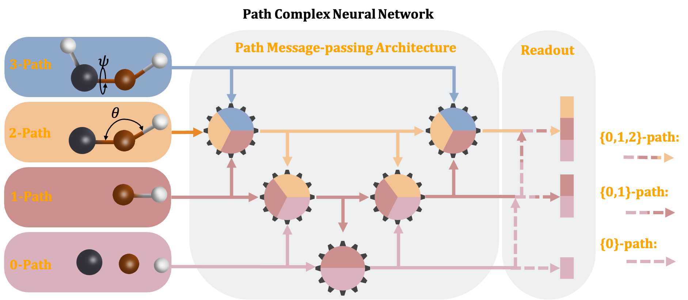
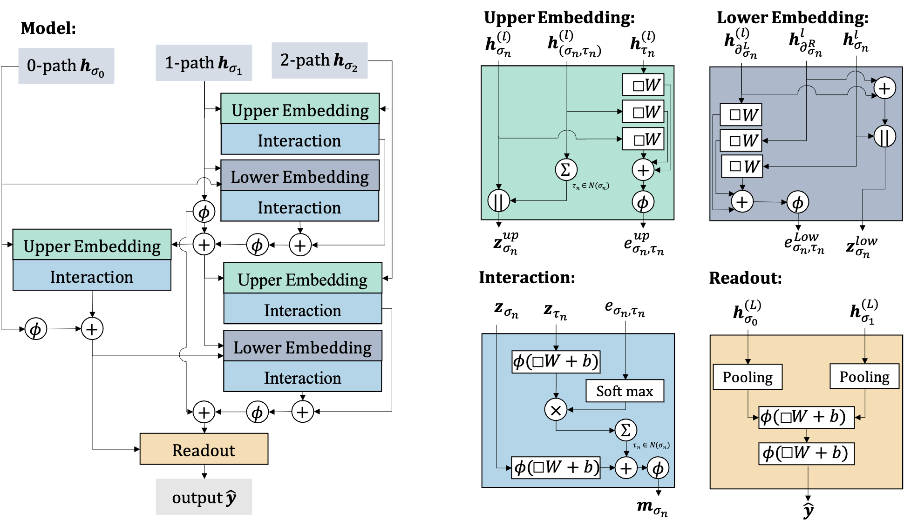

# Path-Complex-Neural-Network
As a generalization of simplicial complexes, path complexes provide a powerful framework for modeling the connections and interactions within a set, such as the atoms in a molecule. By integrating with molecular mechanics models, path complexes can enhance the accuracy of predictions related to molecular properties.

<div align="center">
    
</div>


PCNN (Path Complex Neural Network) is a model that utilizes path complexes to represent and predict molecular data. Our findings highlight the potential of path-based approaches in the molecular sciences, providing new insights into the relationships between molecular structure and function.

The Path Complex Message-passing Architecture:
  

The Path Complex Neural Network Module:
 


## Table of Contents
1. [Environment Requirements](#environment-requirements)
2. [Installation Steps](#installation-steps)
3. [Data Download and Configuration](#data-download-and-configuration)
4. [Running the Project](#running-the-project)
5. [Experimental Results](#experimental-results)
## Environment Requirements

This project requires:
- **Python Version**: 3.11
  - Use Python 3.11, as this is the version used for development and testing of the code.
- **CUDA Version**: 11.7
  - To fully utilize GPU acceleration, ensure that your environment supports CUDA 11.7.

## Installation Steps

### 1. Create a Virtual Environment
Recommended to use conda:
```bash
conda create -n myenv python=3.11
conda activate myenv
```

### 2. Install Dependencies
Install the necessary Python libraries from `requirements.txt`:
```bash
pip install -r requirements.txt
```

### 3. Verify CUDA Installation
Check that CUDA 11.7 is correctly installed on your system:
```bash
nvcc --version
```

## Data Download and Configuration

### Download Data
Download the datasets from [MoleculeNet](https://moleculenet.org/datasets-1). Place the datasets into the `data` directory in your project folder.

### Configure Dataset Usage
To use different datasets, modify the `path.yaml` file in the `config` directory:
```yaml
select_dataset: "qm8"  # Replace "qm8" with "qm7" or "qm9" as needed
```

## Running the Project

Execute the project with the configured dataset by running:
```bash
python main.py
```


## Experimental Results

### Comparison with Non-Pretrained Models
The following table presents the comparison of PCNN with various GNN architectures. The best performance values are highlighted in **bold**, and standard deviation values are indicated in subscripts.

| Method              | QM7               | QM9               | Tox21              | HIV                | MUV                |
|---------------------|-------------------|-------------------|--------------------|--------------------|--------------------|
| **GNN**             |                   |                   |                    |                    |                    |
| GIN                 | 110.3 _(7.2)_     | 0.00886 _(0.00005)_ | *                  | *                  | *                  |
| GAT                 | 103.0 _(4.4)_     | 0.01117 _(0.00018)_ | *                  | *                  | *                  |
| GCN                 | 100.0 _(3.8)_     | 0.00923 _(0.00019)_ | *                  | *                  | *                  |
| D-MPNN              | 103.5 _(8.6)_     | 0.00812 _(0.00009)_ | 0.759 _(0.007)_    | 0.771 _(0.005)_    | 0.786 _(0.014)_    |
| Attentive FP        | 72.0 _(2.7)_      | 0.00812 _(0.00001)_ | 0.761 _(0.005)_    | 0.757 _(0.014)_    | 0.766 _(0.015)_    |
| GTransformer        | 161.3 _(7.1)_     | 0.00923 _(0.00019)_ | *                  | *                  | *                  |
| SGCN                | 131.3 _(11.6)_    | 0.01459 _(0.00055)_ | *                  | *                  | *                  |
| DimNet              | 95.6 _(4.1)_      | 0.01031 _(0.00076)_ | *                  | *                  | *                  |
| HMGNN               | 101.6 _(3.2)_     | 0.01239 _(0.00001)_ | *                  | *                  | *                  |
| Mol-GDL             | 62.2 _(0.4)_      | 0.00952 _(0.00013)_ | 0.791 _(0.005)_    | 0.808 _(0.007)_    | 0.675 _(0.014)_    |
| **Pretrain_GNN**    |                   |                    |                    |                    |                    |
| N-Gram_RF           | 92.8 _(4.0)_      | 0.01037 _(0.00016)_ | 0.758 _(0.009)_    | 0.787 _(0.004)_    | 0.748 _(0.002)_    |
| N-Gram_XGB          | 81.9 _(1.9)_      | 0.00964 _(0.00031)_ | 0.758 _(0.009)_    | 0.787 _(0.004)_    | 0.748 _(0.002)_    |
| PretrainGNN         | 113.2 _(0.6)_     | 0.00922 _(0.00004)_ | 0.781 _(0.006)_    | 0.799 _(0.007)_    | 0.813 _(0.021)_    |
| GROVER_base         | 94.5 _(3.8)_      | 0.00986 _(0.00055)_ | 0.743 _(0.001)_    | 0.625 _(0.009)_    | 0.673 _(0.018)_    |
| GROVER_large        | 92.0 _(0.9)_      | 0.00986 _(0.00025)_ | 0.735 _(0.001)_    | 0.682 _(0.011)_    | 0.673 _(0.018)_    |
| MolCLR              | *                 | *                  | *                  | 0.750 _(0.002)_    | 0.796 _(0.019)_    |
| GEM                 | 58.9 _(0.8)_      | 0.00746 _(0.00001)_ | 0.781 _(0.001)_    | 0.806 _(0.009)_    | 0.817 _(0.005)_    |
| DMP                 | 74.4 _(1.2)_      | *                  | 0.791 _(0.004)_    | 0.814 _(0.004)_    | *                  |
| SMPT                | *                 | *                  | 0.797 _(0.001)_    | 0.812 _(0.001)_    | 0.822 _(0.008)_    |
| **PCNN**            | **53.6 _(2.1)_**  | **0.00683 _(0.00005)_** | **0.801 _(0.002)_** | **0.823 _(0.004)_** | **0.827 _(0.015)_** |


