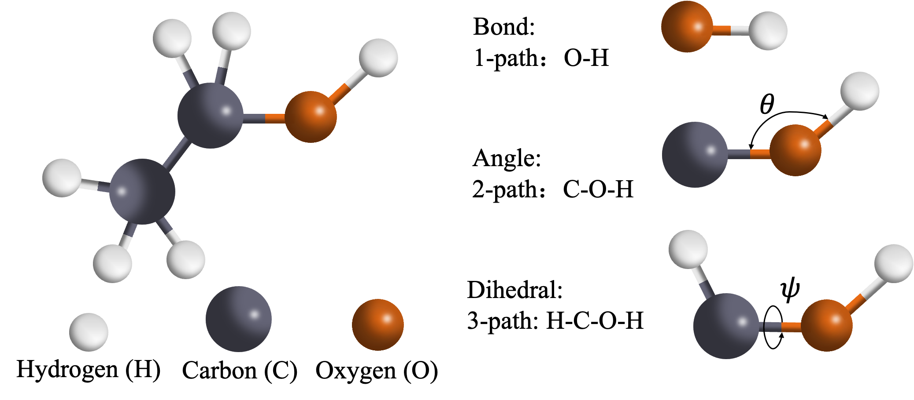

# Path-Complex-Neural-Network
As a generalization of simplicial complexes, path complexes provide a powerful framework for modeling the connections and interactions within a set, such as the atoms in a molecule. By integrating with molecular mechanics models, path complexes can enhance the accuracy of predictions related to molecular properties.

<div align="center">
    
</div>


PCNN (Path Complex Neural Network) is a model that utilizes path complexes to represent and predict molecular data. Our findings highlight the potential of path-based approaches in the molecular sciences, providing new insights into the relationships between molecular structure and function.

The Path Complex Message-passing Architecture:
  <!-- This path points to the PCNN model image in the data/processed directory -->

The Path Complex Neural Network Module:
  <!-- This path points to the PCNN model image in the data/processed directory -->


## Table of Contents
1. [Environment Requirements](#environment-requirements)
2. [Installation Steps](#installation-steps)
3. [Data Download and Configuration](#data-download-and-configuration)
4. [Running the Project](#running-the-project)
5. [Experimental Results](#experimental-results)
## Environment Requirements

This project requires:
- **Python Version**: 3.11
  - Use Python 3.11, as this is the version used for development and testing of the code.
- **CUDA Version**: 11.7
  - To fully utilize GPU acceleration, ensure that your environment supports CUDA 11.7.

## Installation Steps

### 1. Create a Virtual Environment
Recommended to use conda:
```bash
conda create -n myenv python=3.11
conda activate myenv
```

### 2. Install Dependencies
Install the necessary Python libraries from `requirements.txt`:
```bash
pip install -r requirements.txt
```

### 3. Verify CUDA Installation
Check that CUDA 11.7 is correctly installed on your system:
```bash
nvcc --version
```

## Data Download and Configuration

### Download Data
Download the QM7, QM8, and QM9 datasets from [MoleculeNet](https://moleculenet.org/datasets-1). Place the datasets into the `data` directory in your project folder.

### Configure Dataset Usage
To use different datasets, modify the `path.yaml` file in the `config` directory:
```yaml
select_dataset: "qm8"  # Replace "qm8" with "qm7" or "qm9" as needed
```

## Running the Project

Execute the project with the configured dataset by running:
```bash
python main.py
```


## Experimental Results

### Comparison with Non-Pretrained Models
The following table presents the comparison of PCNN with various GNN architectures. The best performance values are highlighted in **bold**, and standard deviation values are indicated in subscripts.

| Method        | MAE-QM7              | MAE-QM8              | MAE-QM9              |
|---------------|----------------------|----------------------|----------------------|
| GIN           | 110.3<sub>(7.2)</sub>| 0.0199<sub>(0.0002)</sub> | 0.00886<sub>(0.00005)</sub>|
| GAT           | 103.0<sub>(4.4)</sub>| 0.0224<sub>(0.0005)</sub> | 0.01117<sub>(0.00018)</sub>|
| GCN           | 100.0<sub>(3.8)</sub>| 0.0203<sub>(0.0005)</sub> | 0.00923<sub>(0.00019)</sub>|
| D-MPNN        | 103.5<sub>(8.6)</sub>| 0.0190<sub>(0.0001)</sub> | 0.00812<sub>(0.00009)</sub>|
| Attentive FP  | 72.0<sub>(2.7)</sub> | 0.0179<sub>(0.0001)</sub> | 0.00812<sub>(0.00001)</sub>|
| GTransformer  | 161.3<sub>(7.1)</sub>| 0.0361<sub>(0.0008)</sub> | 0.00923<sub>(0.00019)</sub>|
| SGCN          | 131.3<sub>(11.6)</sub>| 0.0285<sub>(0.0005)</sub>| 0.01459<sub>(0.00055)</sub>|
| DimNet        | 95.6 <sub>(4.1)</sub>| 0.0215<sub>(0.0003)</sub> | 0.01031<sub>(0.00076)</sub>|
| HMGNN         | 101.6<sub>(3.2)</sub>| 0.0249<sub>(0.0004)</sub> | 0.01239<sub>(0.00001)</sub>|
| GeoGNN        | 59.0<sub>(3.4)</sub> | **0.0173<sub>(0.0003)</sub>**|0.00746<sub>(0.00002)</sub>|
| Mol-GDL       | 62.2<sub>(0.4)</sub> | 0.0205<sub>(0.0001)</sub> | 0.00952<sub>(0.00013)</sub>|
| **PCNN**      | **58.19<sub>(2.1)</sub>** | 0.02029<sub>(0.0006)</sub> | **0.00713<sub>(0.00003)</sub>**|

### Comparison with Pretrained Models
This table shows how PCNN performs against pretrained GNN architectures. Best performance values are in **bold**, and standard deviations are shown in subscripts.

| Method        | MAE-QM7              | MAE-QM8              | MAE-QM9              |
|---------------|----------------------|----------------------|----------------------|
| N-Gram_RF     | 92.8<sub>(4.0)</sub> | 0.0236<sub>(0.0006)</sub>| 0.01037<sub>(0.00016)</sub>|
| N-Gram_XGB    | 81.9<sub>(1.9)</sub> | 0.0215<sub>(0.0005)</sub>| 0.00964<sub>(0.00031)</sub>|
| PretrainGNN   | 113.2<sub>(0.6)</sub>| 0.0200<sub>(0.0001)</sub>| 0.00922<sub>(0.00004)</sub>|
| GROVER_base   | 94.5<sub>(3.8)</sub> | 0.0218<sub>(0.0004)</sub>| 0.00986<sub>(0.00055)</sub>|
| GROVER_large  | 92.0<sub>(0.9)</sub> | 0.0224<sub>(0.0003)</sub>| 0.00986<sub>(0.00025)</sub>|
| GEM           | 58.9<sub>(0.8)</sub> | **0.0171<sub>(0.0001)</sub>**| 0.00746<sub>(0.00001)</sub>|
| DMP           | 74.4<sub>(1.2)</sub> |0.0171<sub>(0.0004)</sub>   | - |
| **PCNN**      | **58.19<sub>(2.1)</sub>** | 0.02029<sub>(0.0006)</sub> | **0.00713<sub>(0.00003)</sub>**|


